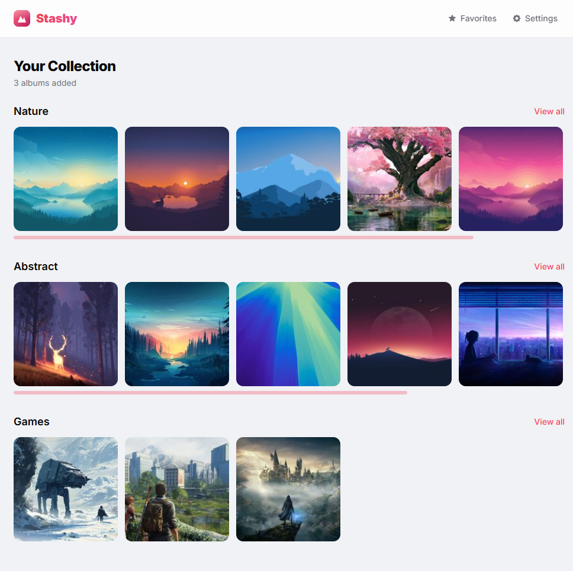

# Stashy

A self-hosted personal media gallery for browsing images and videos over LAN.

[](LICENSE)
[](https://hub.docker.com/r/larsmikki/stashy)
[](https://github.com/larsmikki/stashy/pkgs/container/stashy)
[](https://nodejs.org/)



## Features

- **Album management** — Create albums pointing to folders on disk, drag-and-drop reorder
- **Recursive scanning** — Incremental scan detects additions, changes, and removals
- **Thumbnail caching** — Lazy generation with concurrent batch processing
- **Video playback** — Native streaming (MP4/WebM) with HLS transcoding for other formats
- **Slideshow mode** — Fullscreen slideshow with configurable timing (2–30s)
- **Keyboard & swipe navigation** — Arrow keys and touch gestures in the viewer
- **Server-side folder picker** — Browse the server's filesystem when creating albums
- **Pagination** — Configurable page size (50–500), persisted across sessions
- **Dark mode** — System-aware with manual toggle
- **Optional password protection** — Session-based auth for shared networks

## Getting started

Pick whichever install path matches your setup. All paths land on [http://localhost:3010](http://localhost:3010).

> **Non-Docker installs** need `ffmpeg` on `PATH` (video thumbnails + HLS transcoding). MP4/WebM stream directly without it, but you'll want it for MOV/MKV/AVI/M4V.

### 1. Docker (Docker Desktop, NAS, or any Docker server)

Works on Synology, Unraid, TrueNAS, QNAP, Proxmox, or a plain Docker host. FFmpeg is bundled in the image.

**Docker Compose (recommended)** — edit to mount your media:

```yaml
services:
  stashy:
    image: larsmikki/stashy:latest
    container_name: stashy
    ports:
      - "3010:3010"
    volumes:
      - stash_data:/app/data        # database (persistent)
      - stash_cache:/app/cache      # thumbnails & transcodes (persistent)
      - /path/to/your/media:/media:ro  # your photos/videos (read-only)
    environment:
      - PORT=3010
    restart: unless-stopped

volumes:
  stash_data:
  stash_cache:
```

Mount as many media folders as you like — each becomes a path you can point an album at:

```yaml
volumes:
  - /mnt/nas/photos:/media/photos:ro
  - /mnt/nas/videos:/media/videos:ro
  - /home/user/screenshots:/media/screenshots:ro
```

Then `docker compose up -d`. Open **http://localhost:3010**, go to **Settings → Add album**, and pick a folder (e.g. `/media/photos`).

To update: `docker compose down && docker pull larsmikki/stashy:latest && docker compose up -d`.

### 2. Local install on Windows

```powershell
scoop install nodejs-lts git ffmpeg
git clone https://github.com/larsmikki/stashy.git
cd stashy
npm install
npm run dev
```

Server at http://localhost:3010, Vite dev client at http://localhost:5173. For a production build:

```powershell
npm run build
npm start
```

### 3. Local install on macOS

```bash
brew install node git ffmpeg
git clone https://github.com/larsmikki/stashy.git
cd stashy
npm install
npm run dev
```

For a production build: `npm run build && npm start`.

### 4. Local install on Linux

Debian/Ubuntu:

```bash
curl -fsSL https://deb.nodesource.com/setup_20.x | sudo -E bash -
sudo apt-get install -y nodejs git ffmpeg

git clone https://github.com/larsmikki/stashy.git
cd stashy
npm install
npm run dev
```

On Fedora/RHEL use `dnf install nodejs git ffmpeg`; on Arch use `pacman -S nodejs npm git ffmpeg`.

For a production build: `npm run build && npm start`.

### Environment variables

| Variable   | Default    | Description                        |
|------------|------------|------------------------------------|
| `PORT`     | `3010`     | HTTP port                          |
| `DATA_DIR` | `/app/data`  | SQLite database directory          |
| `CACHE_DIR`| `/app/cache` | Thumbnail and transcode cache      |

## Supported formats

**Images:** JPG, JPEG, PNG, GIF, WebP, BMP, TIFF

**Videos:** MP4, WebM, MOV, MKV, AVI, M4V

## Security

- Path traversal blocked on all file-serving routes (`ensureWithin`, `safePath`)
- Null byte injection prevention
- Parameterized SQL queries throughout
- HLS segment names validated against an allowlist pattern
- JSON body limited to 1 MB
- Session tokens expire automatically
